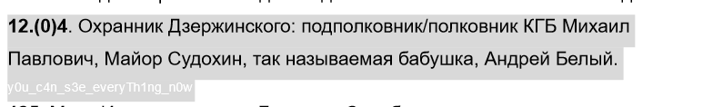

Из описания задания понимаем что Игорь Гофман и "народ" имеют некую связь. Зайдя к нему на ютуб канал, видим ссылку в описании на его так называемый блог,gofman39.narod.r Проведя немного времени на сайте заходим в его "Гостевую книгу" и видим сообщение обращенное к стферам 
Переходим по ссылке, видим там гугл документ со списком всех персонажей из вселенной Игоря Гофмана, флаг прячется в документе в пункте 124(пункт выбран в честь даты начала ctf 12(.0)4) белым текстом

Flag: kxctf{y0u_c4n_s3e_everyTh1ng_n0w}
