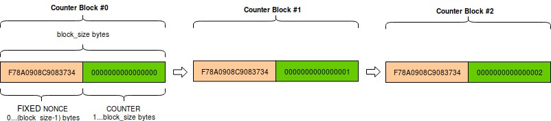

# The countdown

## Описание

При тестировании новой суперзащищённой криптосхемы потокового шифрования с проверкой целостности работниками НИИ была допущена фатальная ошибка, приведшая к сбою всей компьютерной сети комплекса. После нескольких часов работ по возобновлению функционирования сети было обнаружено, что в результате сбоя утерян важный флаг, без которого дальнейшая работа НИИ невозможна.  
После применения многочисленных процедур восстановления данных был получен текст, содержащий нужный флаг. Однако он зашифрован исследуемой криптосхемой. Благодаря высокой надёжности криптосхемы весь текст скорее всего восстановить не удастся, но возможно получится восстановить именно тот блок данных, который содержит флаг. Найти способ, как это сделать, предстоит вам.  

flag: kxctf{T8M4nyEnc}

## Writeup

Режим шифрования CTR работает следующим образом:  

  

Для инициализации счётчика используются различные методы, но в случае с библиотекой pycryptodome это происходит следующим образом:  

  

То есть nonce дополняется нулями и номером блока до размера блока.  
В предложенной криптосхеме nonce дополняется по стандарту pkcs7 до размера блока и шифруется тем же ключом, что и текст. Дополнение по этому стандарту происходит следующим образом: значение каждого добавленного байта равно числу добавленных байтов, то есть добавляется N байт со значением N. Например:  
0x01  
0x02 0x02  
0x03 0x03 0x03  
0x04 0x04 0x04 0x04  
0x05 0x05 0x05 0x05 0x05  
И так далее.  
В данном случае дополняется nonce размером 15 байт, а значит дополнением будет байт 0x01. Вернувшись к схеме инициализации счётчика, мы можем понять, что, зашифровав дополненный подобным образом nonce, мы получим гамму для второго блока, в котором, по странному стечению обстоятельств, находится флаг.  
Вывод. Слишком много шифрования не всегда хорошо.  