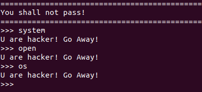
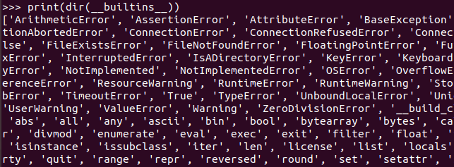

# Jail Breaker: Write-Up

При подключении на сервер с помощью `nc` видим сообщение `You shall not pass!`.

Пытаемся понять, что мы можем делать для обхода ограничений. Каждая недоступная команда сопровождается сообщением `U are hacker! Go Away!`.

Составим из них список:



Полный список по итогу выглядит так:
```
['eval', 'exec', 'import', 'open', 'os', 'read', 'system', 'write']
```

### Пробуем обойтись иначе

Так как мы взаимодействуем с python, можем вызвать `__builtins__`:



Альтернативный способ это сделать `print(__builtins__.__dict__)`.

Теперь можем вызвать функции, но помним о том, что у нас есть ограничения.

Поэтому запрос вида `print(__builtins__.__dict__['open'])` не пройдет, обойти это можно так `print(__builtins__.__dict__['OPEN'.lower()])`.


Теперь составим запрос для вывода всех файлов, чтобы найти нужный. А затем прочитаем его и получим флаг: **kxctf{byp4ss_r3str1ct1ons_is_pr3c10us}**.

