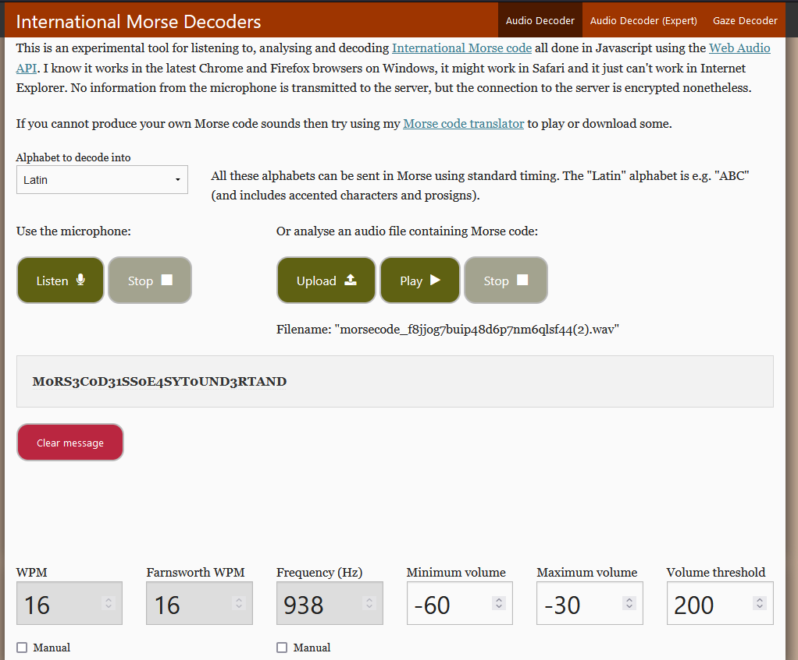

С помощью file, либо hexeditor понимаем, что прикрепленный файл является не текстовым а .wav
Слушаем содержимое, исходя из него делаем выводы что на записи азбука морзе
Любым удобным нам способом с помощью блокнотика и ручки, кодом на питоне или онлайн сервисом получаем флаг  приводим его к нижнему регистру и оборачиваем в kxctf{}: kxctf{m0rs3c0d31ss0e4syt0und3rtand}