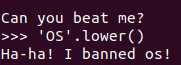
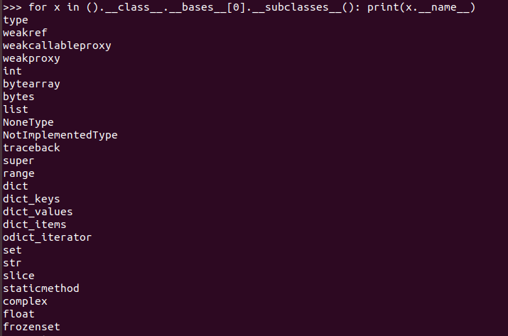

# Unjailed: Write-Up

При подключении на сервер с помощью `nc` видим сообщение `Can you beat me?`. Если уже решили первый Pyjail, то порядок действий известен.

### Определяем ограничения

В этом случае список запрещенных команд больше, чем в прошлом Pyjail.
Каждый раз, когда мы вводим недопустимое значение получаем сообщение `Ha-ha! I banned {value}`:



Полный список ограничений:

```
[import, chr, os, sys, system, builtin, exec, eval, subprocess, pty, popen, read, get_data, cat ,ls, bin]
```

Но обойти это можно, например, так:


### Создаем пэйлоад

Выведем имена подклассов:




Теперь ищем в интернете пути выхода из Pyjail (например, [тут](https://book.hacktricks.xyz/generic-methodologies-and-resources/python/bypass-python-sandboxes)), мы можем начать использовать подклассы/их встроенные функции, к которым можем получить доступ, чтобы обойти ограничения.

За основу возьмем эту нагрузку с перебором subclasses: `[ x.__init__.__globals__ for x in ''.__class__.__base__.__subclasses__() if x.__name__ == '_wrap_close' ][0]['system']('ls')`

В процессе эксплуатации нам нужно будет обойти несколько ограничений:

1. Мы не можем использовать `system`, но уже знаем как это обойти, достаточно разбить это на две строки и сложить `...['sy'+'stem']...`
2. Ограничение `ls` и `cat` можно обойти таким же способом, но будет продемонстирован еще один вариант. В Linux можно вызывать команды по полному пути `/bin/ls`, но так же можно заменить один или несколько символов на `?`, в итоге получится:  `[ x.__init__.__globals__ for x in ''.__class__.__base__.__subclasses__() if x.__name__ == '_wrap_close' ][0]['sy'+'stem']('/bi?/?s ./')`

Получив возможность просмотра всех файлов, находим нужный и вычитываем из него флаг, используя уже известные техники обхода.

Вот и все, мы получили флаг: **kxctf{7h1s_t1m3_y0u_m4n@g3d_t0_e5c@pe_but_th1s_1s_n0t_the_end_w3_vv1ll_s33_you_@g4in}**