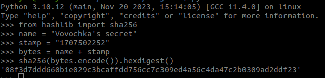

# Vovochka's secret writeup


## Описание

Наш маленький Вовочка явно что-то скрывет - у него даже появился собственный сейф, куда он записывает все свои грязные мыслишки. Но точно ли это спасет его?

- [Bot](https://t.me/VovochkaGeniusSecretBot)
- [Source code](src/)

## Райтапчик

## Описание баги

Уязвимость заключалась в ошибочной подстановке параметров при создании экземпляра класса `Secret`

Конструктор принимает:
```python 
secret = Secret(args[0], message.chat.id, stamp, args[1])
```

В то время, как должен принимать:
```python
class Secret:
    def __init__(self, name_secret, timestamp, telegram_id, secret):
        ...
```

Из-за этого в атрибуте `self._telegram_id` оказывается извесное всем пользователям значение времени создания секрета, после чего от него (после конкатенации) берется хэш, который считается секурным паролем.

## Киллчейн

- Для начала смотрим на время создания секрета


- Переводим время в таймстемп, **добавляя 3 часа**, так как в коде он берется в `UTC`


- Конкатинируем полученный таймстемп с названием секрета и берем от этого хэш



- Забираем у бота флаг


## Флаг
`kxctf{v0v04ka_n3vn1m4t3lno_c0d3_p1sh3t}`

## Powered by [FrakenboK](https://github.com/FrakenboK)

