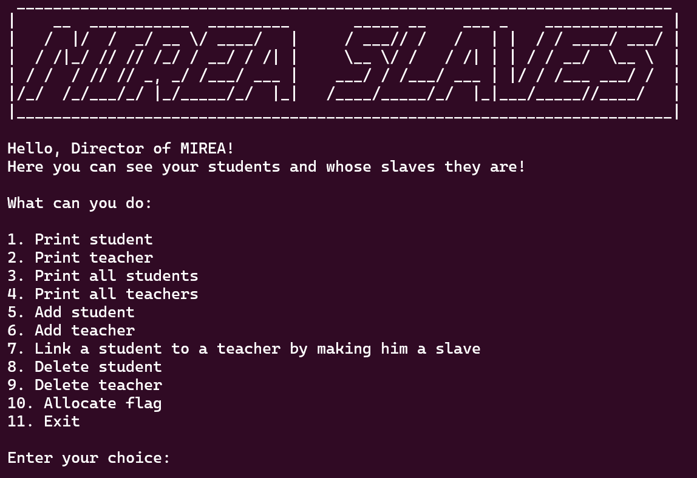
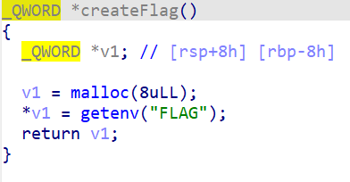
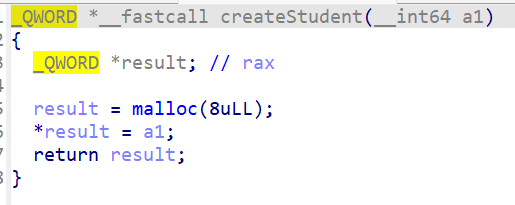
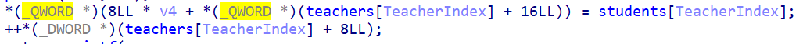
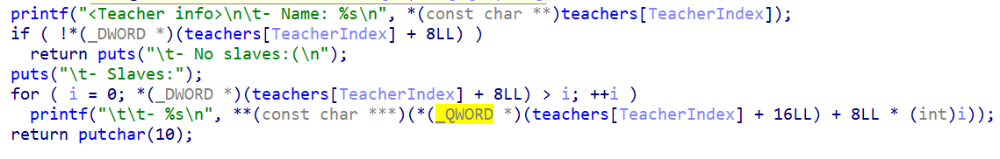
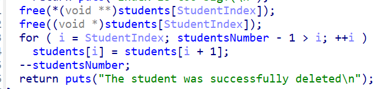
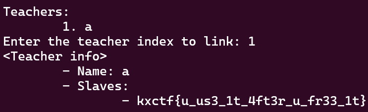

# MIREA slaves writeup

## Описание таска

"Пывн есть вещь, распределенная справедливее всего"
Пывн Пывнов - 1337 г. до н. э.

## Флаг

`kxctf{u_us3_1t_4ft3r_u_fr33_1t}`

## Сначала немного теории

Use after free - довольно популярная уязвимость в сфере бинарных эксплуатаций.
Для тех, кто не в танке - вкраце объясню, как она работает.

Когда мы используем `malloc` в языке C, мы выделяем место определенного размера (определенное количества байт, давайте для примера обусловимся, что мы взяли 8) в области памяти, называемом кучей. Далее, мы можем произвольным образом работать с этой памятью, например - записать в нее структуру. В конце концов - мы можем эту память очистить, используя функцию `free`, которая пометит память как незанятую и сохранит информацию о свободном чанке определенной длины. Когда мы в следующий раз будем выделять память такой же длины (в нашем случае 8), компилятор не будет искать новую память во всей куче, а сначала проверит информацию об очищенных чанках и приоритетно выделит ту память, которая уже была очищена до этого. Тут стоить отметить, что это работает только в том случае, если мы выделяем память такого же объема - в нашем случае такая стратегия не будет работать, если мы будем выделять 16 байтов или, скажем, 9. 

##### Как это использовать?

А использовать это можно очень интересным образом. После повторного выделения памяти мы можем положить в нее совершенно другую инфоромацию (вообще использовать ее совершенно другим способом - не обязательно структуру, но давайте мы условимся, что мы используем другую структуру такого же объема). Однако, если где-то в логике программы мы продолжаем обращаться к старой очищенной страктуре, то мы сможем нелегитимно обратиться и к новой, лежащей на том же физичестком месте на куче, используя старый функционал, даже если логика программы не содержит никакого взаимодействия с новой структурой.

Если хотите узнать об этой уязвимости более подробно - глянтье [видос от Влада Роскова](https://www.youtube.com/watch?v=dcEusDyHj9s) из команды SPbCTF

## Райтап

Приложение представляло из себя Админку учебной организации, в которой мы могли создавать студентов и преподавателей, а также привязывать одних к другим.

Давайте декомпилить и изучать, как это работает.

Первое, что стоит заметить, это то, что память с структурой, в которой содержится флаг, мы можем аллоцировать в любой момент, введя `10`:

Далее стоит отметить, что структура студента тоже содержит 8 байт:

Получается, если мы сделаем `free` от какого-то студнета, а после этого аллоцируем флаг, то структура с флагом очутится в той же ячейке памяти, что и очищенный студент. Также, если у нас появится возможность обратиться к имени удаленного студента, то по сути, мы сможем обратиться непосредственно к флагу, который займет место его имени. (И у структуры флаг и у структуры студента есть всего единственное поле, которое имеет тип `char*`)

Немножко изучив логику программы, вы могли разобраться, как работает функция привязки студента к преподавателю - в отдельное поле преподавателя добавлялся указатель на структуру студента:

Также мы могли заметить, что при выводе информации о преподавателе, программа выводит еще и информацию о привязанных студентах, используя внутренний массив указателей на структуры этих привязанных студентов:

Теперь посмотрим, как происходит удаление студента:

Мы можем заметить, что мы просто очищаем память, где хранилась строка name и непосредственно сама структура студента. А удаляется ли указатель на этого студента в полях преподавателей, к которым он был привязан??? Ответ простой - нет. 

Получается если мы привяжем студента к преподавателю, удалим этого студента, аллоцируем флаг, а потом выведем информацию о преподавателе, то мы увидем флаг среди студентов этого препода. (Алгоритм смотри в эксплойте)

## Powered by [FrakenboK](https://github.com/FrakenboK)