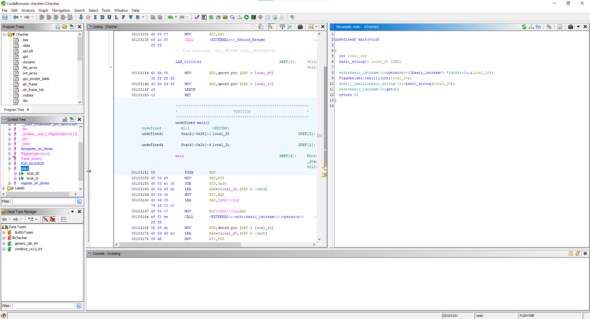
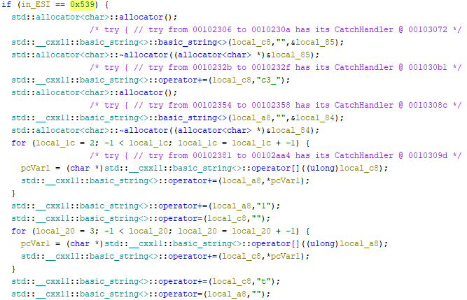

# Checher writeup

Нам дан скомпилированный файл ELF `Checher` написанный на C. Это можно узнать при помощи команды `file` в Linux или при открытие его в дизассемблере, например: [ghidra](https://github.com/NationalSecurityAgency/ghidra)

### Время обратной разработки

Открыв файл в декомпиляторе, видим следующее:

Сразу в глаза бросается функция `FlagGen()`, которая принимает числовое значение в качестве параметра. 

Изучим ее подробнее. Куча переменных, два ветвления и много циклов в каждом из них. Разберемся от чего зависят ветвления, как нам попасть в if и нужно ли нам сюда? В if идет сравнение переданного в функцию параметра с числом `0x539`, представим это число в десятичной форме, получим - `1337`. Попав в if и изучив циклы можно понять, что кажый из них переворчивает строку и дописывает в нее символы флага.

Пройдя все циклы можно получить строку, напоминающую флаг **kxctf{n1c3_try_:))}**, но он фейковый.

Тоже самое проделываем с else, но тут получается не читаемая для человека строка `NN4GG5DGPN2V6YLDG52TI3DMPFPWOMBQMR6Q====`, которая преобразована в base32.  Придать ей нужный вид можно с помощью [сайта](https://emn178.github.io/online-tools/base32_decode.html) и получим верный флаг **kxctf{u_ac7u4lly_g00d}**