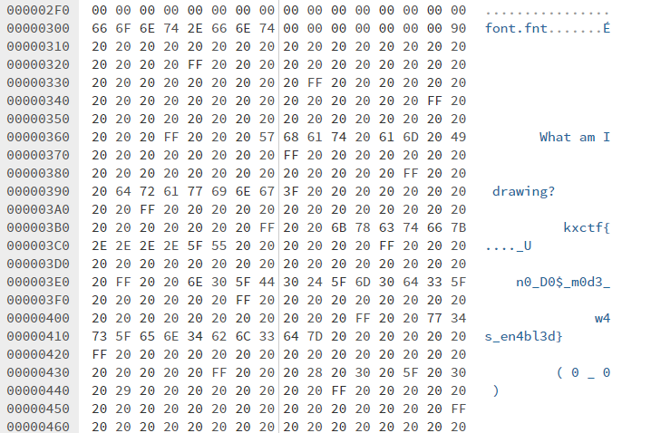

# Dosya writeup

Нам дан скомпилированный exe-файл написанный на TASM и шрифт. При попытке запуска получаем ошибку о невозможности сделать это на нашем ПК.

### Зайдем с другой стороны

При изучении данного файла, можно заметить, что DOS-заглушка была изменена и в ней содержится текст с частью флага. Сделать это можно с помощью [hex editor](https://hexed.it/).

Запустим наш файл в DOS режиме через [эмулятор](https://www.dosbox.com/), где увидим анимацию огня, что и является второй частью флага. Ведь не просто так спросили, что рисует программа.

Заменяем точки на fire и получаем флаг: **kxctf{fire_Un0_D0$_m0d3_w4s_en4bl3d}**
