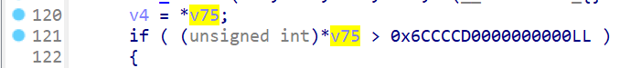
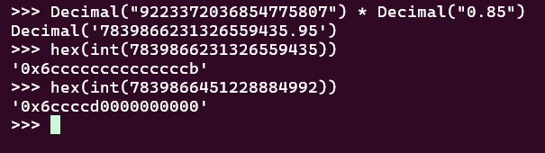
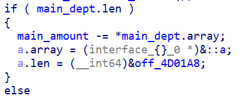

# IT Market Writeup

## Описание таска

"Где гошка, там нет сишки."
Реверс Реверсов - 1337 г. до н.э.

## Флаг

`kxctf{h0h0h0h0_s0_v3ry_cr00k3d_f1ng3r$}`

## Райтап

Я долго думал, к какой категории отнести этот таск, но по итогу сошелся на реверсе, а не на пывне, потому что не увидел никакой эксплуатации памяти + в таске есть логическая бага, а это не то, чего ждешь от пывна. 

### Первая бага

В иде мы видем интересный хекс:


Чтобы понять, откуда он взался, надо посмотреть как работают базовые типы в go. В исходном коде была прмерно вот такая конструкция, которая на выходе давала страшный хекс в иде:
```go
package main

import "fmt"

const maxint = 9223372036854775807

func main() {
	//Получаем: 7839866451228884992 - это и есть страшный хекс
	fmt.Println(int(float32(maxint) * 0.85))
}
```
Однако, если мы произведем те же действия со стопроцентной точностью, то мы увидем, что голэнг облажался и мы получили число больше, чем оно есть на самом деле:


Происходит это из-за конвертации float (который хранит ограниченное количество байтов для умножения на 10 в n-ной степени) в int. Округляет боследний байт гоу, какого-то хрена, в большую сторону для 6-ого байта.
Таким образом, деля введенное число на 0.85 (добавляя процент с продажи для магазина), мы могли получить integer overflow и одновременно обойти проверку с константой, которая была криво преобразована на этапе компиляции, и создать товар с отрицательной ценой.

Однако этой уязвимости нам недостатчно, чтобы получить сверх большой баланс. При покупке товара после integer overflow у нас будет баланс равный минимальному интеджеру в golang.

### Вторая бага

Вторая уязвимость логическая. Она заключалась в отсутствии проверки при выплате долга, была только проверка на наличие долга:

Мы могли возвращать деньги бесконечное число раз, уходя в минус. Однако эта уязвимость в отрыве от первой тоже не могла привести нас к флагу, ибо, чтобы сделать integer overflow с другой стороый, потребовалось бы выплачивать долг ОЧЕНЬ много раз.

## Итог

Решение таково:
- Создаем товар через int overflow
- Берем в долг
- Возвращаем его до того момента, как не получим отрицательный баланс
- Покупаем созданный нами товар и получаем невероятно большой баланс
- Покупаем флаг

Вот тут [эксплойт](exploit/exploit.py)

## Powered by [FrakenboK](https://github.com/FrakenboK)