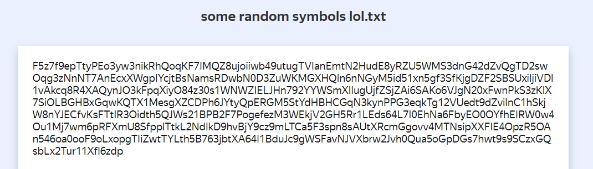
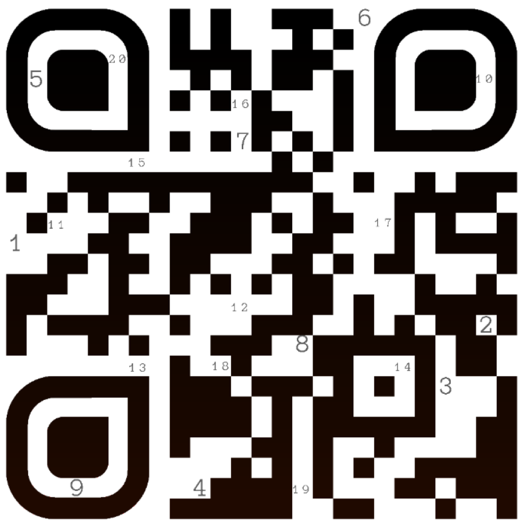
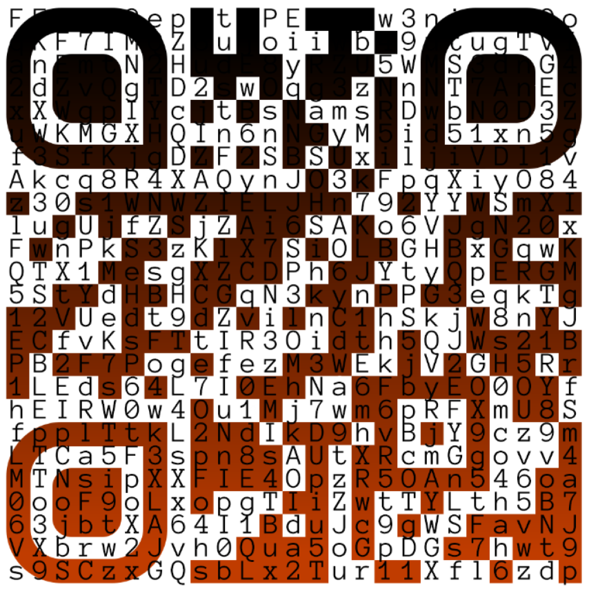

# just qr lol

## Описание

hey guys, don't mind if i just put my qr here? lol

don't scan it!!! lololololol

lol

# Writeup

Для начала, конечно, отсканируем наш QR-код. Мы попадаем на [диск](https://disk.yandex.ru/client/disk/kxctf%7B%7D) с текстовым файлом следующего содержания:

Анализ метаданных текстового файла и png-QR-кода ничего не даёт, давайте попробуем посмотреть, нет ли чего-то необычного на самой картинке. Для этого заходим в любой фоторедактор и пробуем выкручивать параметры изображения. При понижении яркости замечаем, что на png начали проявляться цифры:

Осталось только понять, что эти цифры обозначают. Вспоминаем, что на диске лежит набор символов: и удивительным образом QR-код состоит из квадратиков 25х25, а символов в файле на диске именно 625. Подставляем символы так, чтобы одному квадратику на QR-коде соответствовал один символ:

Теперь можем получить флаг:

`QRc0d3SarEn3wF4sH1oN`