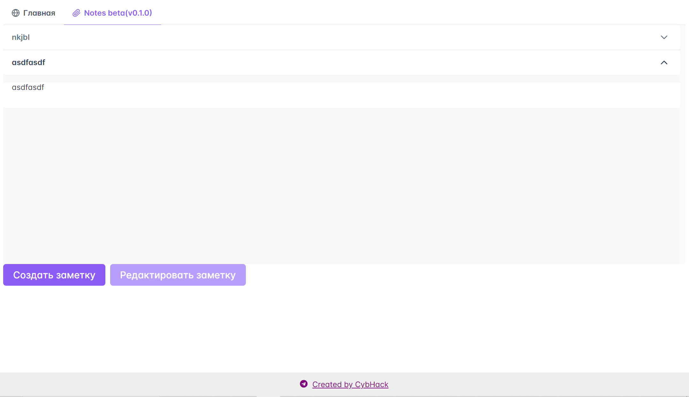
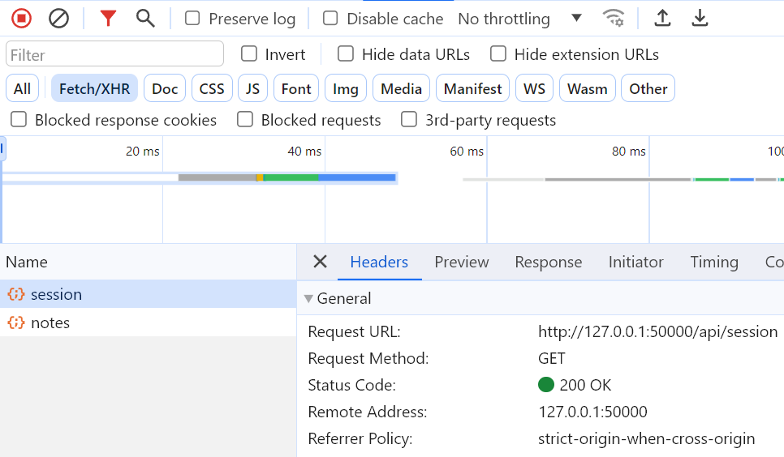

# Noter: Write-Up

Переходим по ссылке и поподаем на главную страницу сервиса, который представляет из себя корпоративный портал с заметками. 

Переходим к самому приложению, замечаем, что можем создавать заметки и смотреть их. При этом есть кнопка редактировать, но она не доступна

С помощью вкладки Network в инструментах разработчика посмотрим исходящие запросы и увидим два запроса. Первый на `/api/session` для получения сессии, второй на `/api/notes` для получения заметок.

Идем смотреть код нашего приложения. После изночального изучения кода нам бросается в глаза endpoint `/api/note/:uuid/update` к которому у нас нет доступа из клиента.

Видим, что некий Антон Кирилов считает имплементацию этого метода хорошей, почему-то ему не хочется верить на слово, проверим)

Параметр **uuid** забирается из пути, а **prop** и **value** забираются из GET параметров. Создаются два локальных объекта config и notes, notes заполняется заметками из базы данных.

После чего проверяется конфигурация для заметки(создал ли ее админ или нет) и в зависимости от этого заполняется локальный обьект config.

Из оставшегося куска функции мы можем заметить, что функция update доступна только админам и собственно если мы сможем это обойти то получим наш флаг. Здесь-то и заключается вся магия.

Выше мы видели, что если заметка создана админом в конфиг явно кладется isAdmin=true, но если нет, то явно isAdmin=false нет. Это поведение вместе с функцией updateNote открывает нам возможность к уязвимости SSPP (ServerSidePrototypePollution) уязвимость JS, основаная на спецефичности наследования в языке. При создании, все обьекты наследуются от одного прототипа. В следствии чего если мы явно **не указываем** свойство для обьекта явно например `object1.test=true`, и може через другой обьект написать такое свойство прототипу `object2.__proto__.test = true`. Тогда при вызове object1.test нам вернется true.

Собственно в нашем случае у нас есть два объекта config и notes.
В config-е если заметка создана администратором назначается проперти isAdmin=true, но если нет, то false явно не назначается. Также присутствует функция `updateNote`, которая позволяет обнавлять заметки, но если мы через нее заразим прототип значением isAdmin=true, тогда сможем получить флаг

`http://<API-URL\>/api/note/67bdaf3f-aa8e-4d29-ba7e-e3d74689aae4/update?prop=title&value=helloworld `

Так выглядит запрос на обновление заметки. Uuid из пути и два гет параметра подставляются в функцию updateNote

Составим вредоносный запрос он будет выглядить так

`http://<API-URL\>/__proto__/update?prop=isAdmin&value=true`

Получаем флаг

